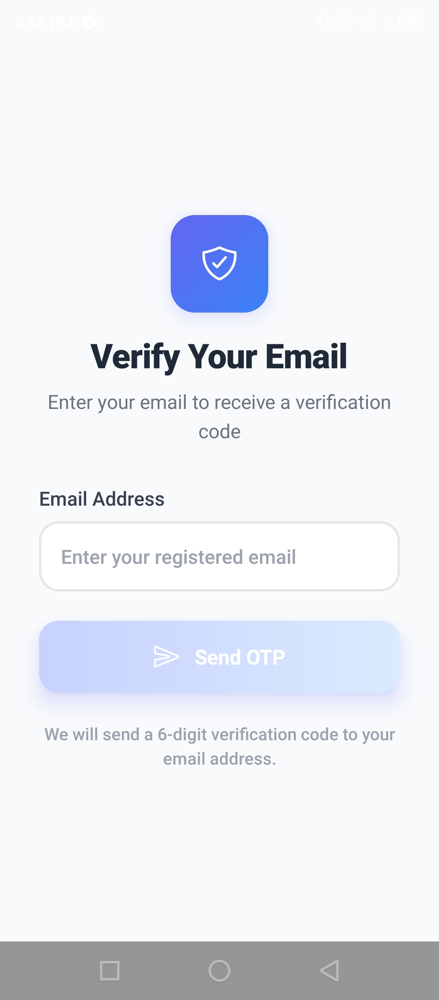
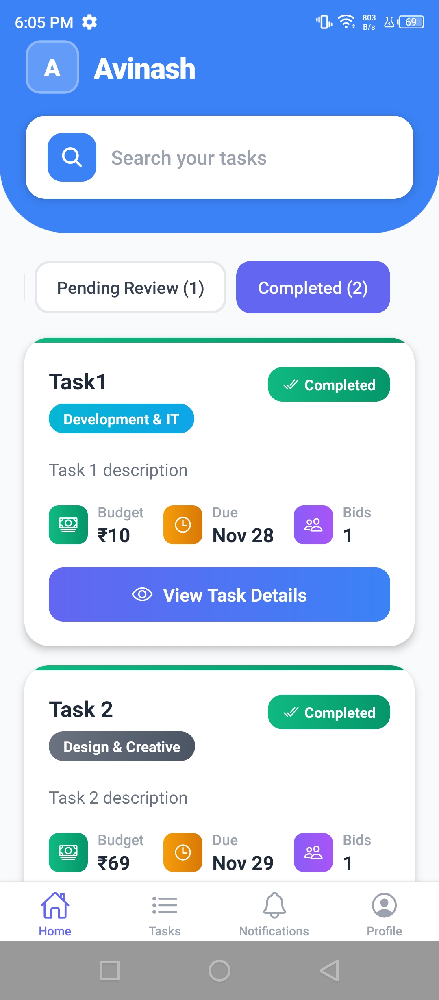
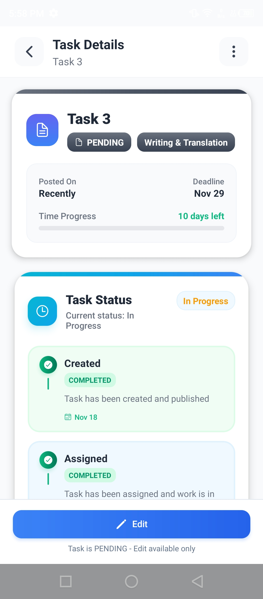
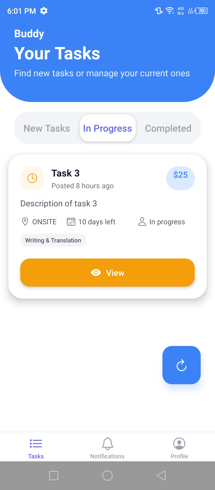
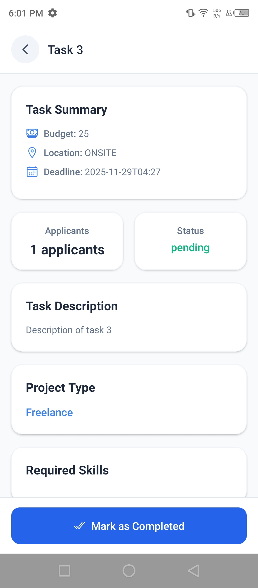
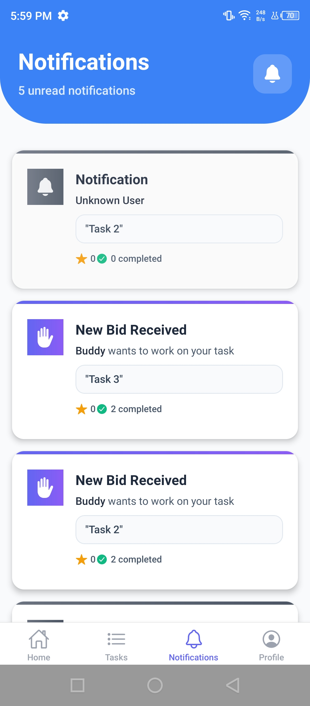
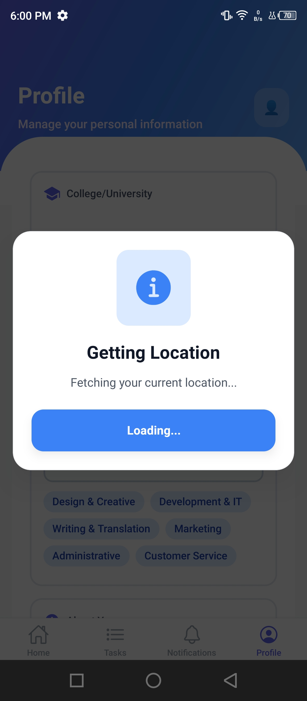
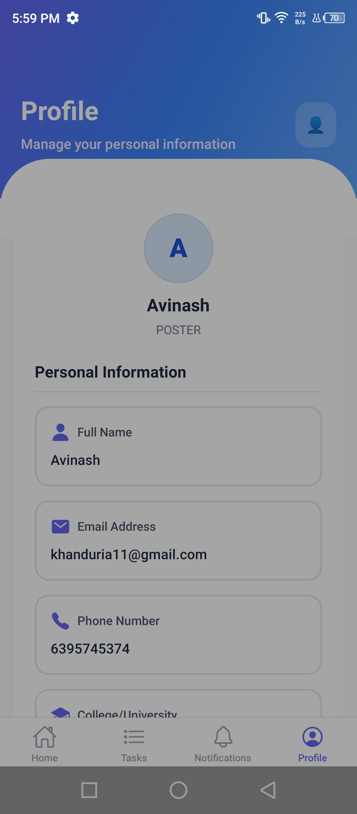

SnapTask

SnapTask is a task-based collaboration app where people who need work done (Posters) can post tasks, and people willing to do the work (Seekers) can bid and complete them.
The goal of this project is to provide a smooth, real-world experience where posting tasks, managing bids, handling notifications, and completing work feels simple and reliable.

This project includes a React Native (Expo Router) mobile application and a Spring Boot + MongoDB backend.
Both sides are built to be scalable and ready for production-level use.

Android Preview Build

You can directly download and install the latest Android preview build using the link below.
This is the same build I use for testing the app on real devices:

Download Build:
https://expo.dev/accounts/avinash_khanduri.dev/projects/HelpHive_client/builds/08033560-d01f-415d-905c-330d49f4fd48

How SnapTask Works 

Below is a breakdown of how different parts of the app work.
Each section also includes a screenshot placeholder so you can replace them later.

1. Authentication and Authorization (JWT + RBAC)

The app uses a proper authentication system built with Spring Security.
Every user gets a JWT token after login, and based on their role (Poster or Seeker), they see different screens and features.

The RBAC system makes sure Posters cannot access Seeker-only APIs and vice-versa.
This keeps everything clean and prevents weird edge-case bugs.

What it means for real users:
People only see what they’re supposed to see.

Screenshot:

2. Complete Poster Flow (Task Posting, Managing, Assigning)

Posters can create tasks by filling in details like title, category, budget, deadline, and task mode.
Once a task is posted, Posters can:

See bids coming from Seekers

Check seeker profiles

Accept or reject bids

Assign the task

Track progress

Close the task after completion

This makes the workflow similar to real gig platforms but much simpler.

Screenshot:

.jpg)

3. Seeker Flow (Bidding + Completion)

Seekers get a list of available tasks and can place bids with their price and proposal.
They can update their skills, respond faster, and track their accepted tasks.

Once a bid is accepted, Seekers update task progress and finally mark it completed with notes and submission proof.

Screenshot:

.jpg)

4. Real-Time Notifications (Expo Push + FCM)

The app supports real-time notifications for things like:

New bids

Bid accepted or rejected

Task updates

Account verification

Deadline alerts

Expo push + Firebase Cloud Messaging handles all the notification delivery.
Both background and foreground notifications are supported.

The system also stores notifications in MongoDB and shows them in the app.

Screenshot:

5. Location-Based Features

SnapTask also comes with live-location support.
Some notifications and certain task recommendations can be based on user location.

Posters can also receive updates about Seekers working nearby.

Location is stored using MongoDB’s GeoJSON structure, which makes distance queries easy and efficient.

Screenshot:

6. User Profile Management

Each user has their own profile where they can update:

Name

Email

Skills

Phone number

Profile picture

Role (Poster / Seeker)

Seekers also have performance metrics like success rate, completion count, and response time.

Screenshot:

7. Completion System

Once a Seeker finishes a task, they submit:

A note

Evidence or work links

Completion timestamp

The Poster then reviews the submission and approves it.
The whole workflow is stored and tracked in MongoDB using a proper embedded CompletionDetail model.

Screenshot:

8. Timeline & Dashboard Summaries

Both Poster and Seeker dashboards have quick summaries:

Active tasks

Pending tasks

Completed tasks

Bids count

Notifications

Task timelines

These summaries are specially designed to load fast and help users understand their activity without navigating too much.

Screenshot:

Tech Stack

Frontend

React Native

Expo Router

Context API

Axios with interceptors

Backend

Spring Boot

Spring Security (JWT + RBAC)

Spring Data MongoDB

Firebase FCM

Database

MongoDB with lightweight references

GeoJSON for location

Proper indexes for performance
